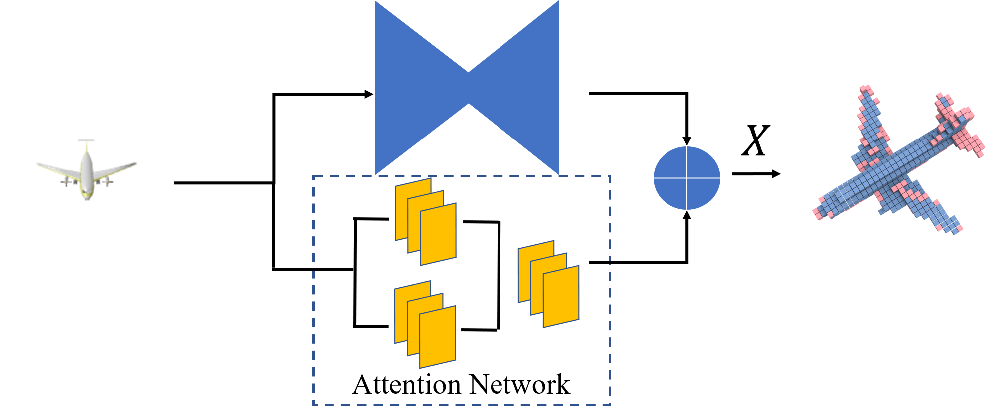
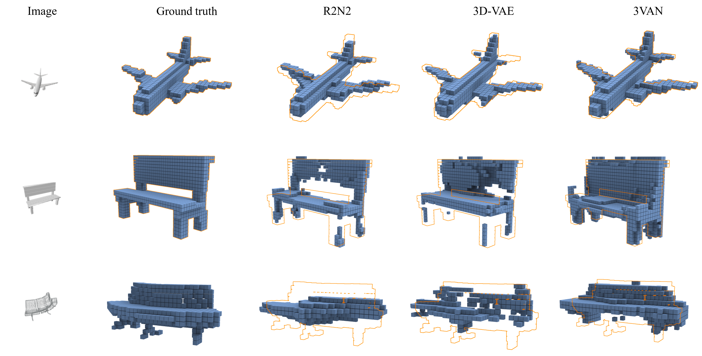
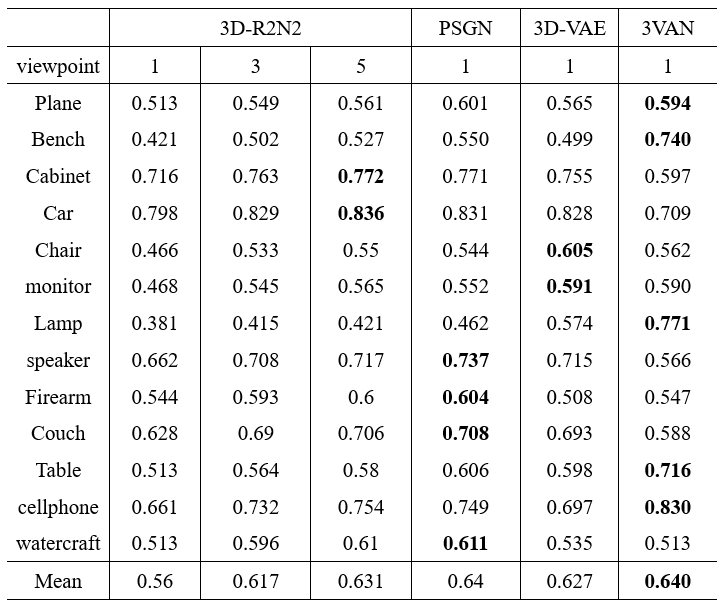

## 3VAN:A Parallel System for Single-view 3D Reconstruction

This is the official implementation of [3VAN:A Parallel System for Single-view 3D Reconstruction](http://diglib.eg.org/xmlui/handle/10.2312/pg20181279)&nbsp; (The 26th Pacific Conference on Computer Graphics and Applications).


### Introduction

3D object reconstruction from single view image is a challenge task. Due to the fact that the information contained in one isolated image is not sufficient for reasonable 3D shape reconstruction, the existing results on single-view 3D reconstruction always lack marginal voxels. To tackle this problem, we propose a parallel system named 3D VAE-attention network (3VAN) for single view 3D reconstruction. Distinct from the common encoder-decoder structure, the proposed network consists of two parallel branches, 3D-VAE and Attention Network. 3D-VAE completes the general shape reconstruction by an extension of standard VAE model, and Attention Network supplements the missing details by a 3D reconstruction attention network. In the experiments, we verify the feasibility of our 3VAN on the ShapeNet and PASCAL 3D+ datasets. By comparing with the state-of-art methods, the proposed 3VAN can produce more precise 3D object models in terms of both qualitative and quantitative evaluation.

### Overall Pipeline

<div align="center">
 
 <p><font size="2">It decomposes the 2D-to-3D reconstruction task into two branches.
(a)3D-VAE: This branch extends the standard VAE for adapting to 3D reconstruction tasks. It reconstructs rough 3D object shape conditioned on a single image which is sampled from an arbitrary view, yielding an uncompleted volumetric occupancy. 
(b)Attention Network: By inputting the same single view image, it makes up the defects in uncompleted volumetric occupancy and reconstructing detailed voxel occupancy to integrate the 3D shape. 
(c)Eventually, we combine these two aforementioned outputs together to get the completed 3D shape of object model. </font></p>
</div>


### Results on the ShapeNet Dataset

<p align="center"> </p>

### Requirements
All the codes are tested in the following environment:
* Ubuntu 16.04/Window 10
* Python 3.5.6（Anaconda 4.5.11）
* tensorflow 1.10.0
* CUDA 9 & CuDNN 7

### Performance 

IoU scores on the ShapeNet dataset are listed below.

<p align="center"> </p>

### Installation

(1) Clone this repository.
```
git clone https://github.com/tomztyang/3van
cd van
```

(2) Setup Python environment.
```
conda create -n 3van
source activate 3van
pip install -r requirements.txt
```

Download and install tensorflow-1.4.0 which is compiled with CUDA-9.0 and CuDNN-7.0.0.
```
pip install tensorflow-gpu==1.10
```


### Prediction/Test

Demo

```
python demo.py
```

Then run the model on your image.


```
python demo.py --image sample.png --obj prediction.obj
```


### Citations
If you find our work useful in your research, please consider citing:
```
@inproceedings {.20181279,
booktitle = {Pacific Graphics Short Papers},
editor = {Fu, Hongbo and Ghosh, Abhijeet and Kopf, Johannes},
title = {{3D VAE-Attention Network: A Parallel System for Single-view 3D Reconstruction}},
author = {Hu, Fei and Yang, Xinyan and Zhong, Wei and Ye, Long and Zhang, Qin},
year = {2018},
publisher = {The Eurographics Association},
ISBN = {978-3-03868-073-4},
DOI = {10.2312/pg.20181279}
}
```

### Acknowledgment
This work is supported by the National Natural Science Foundation of China under Grant Nos. 61631016 and 61371191, and the Project of State Administration of Press, Publication, Radio, Film and Television under Grant No. 2015-53 and the Fundamental Research Funds for the Central Universities No.2018XNG1825. 


### Contact
If you have any questions or suggestions about this repo, please feel free to contact me(hufei@cuc.edu.cn).
